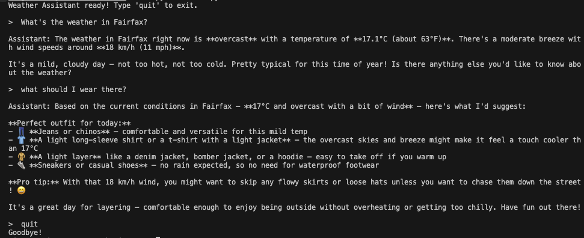

# AI Weather Assistant

A conversational CLI tool that combines live weather data with AI to answer 
weather questions and suggest outfits based on real-time conditions.

## Features

- Get live weather for any city in the world
- Ask follow-up questions in natural conversation
- Get outfit suggestions based on actual weather conditions
- Powered by the Anthropic Claude API and Open-Meteo

## Demo



## Installation

1. Clone the repo
```bash
   git clone https://github.com/messi912/ai-project.git
   cd ai-project
```

2. Install dependencies
```bash
   pip3 install anthropic requests python-dotenv pytest
```

3. Add your API key — create a `.env` file in the root folder:
```bash
   cp .env.example .env
```

4. Run the assistant
```bash
   python3 main.py
```
## Running Tests

```bash
python3 -m pytest test_weather.py -v
```

## What I Learned

- How to chain multiple REST APIs together to build a real data pipeline
- How to integrate an LLM API and manage conversation history across turns
- How to engineer prompts to make an LLM trigger specific actions (tool-calling pattern)
- How to write and run unit tests with pytest

## Tech Stack

- Python 3.12
- [Anthropic Claude API](https://www.anthropic.com)
- [Open-Meteo API](https://open-meteo.com) (weather + geocoding)
- pytest